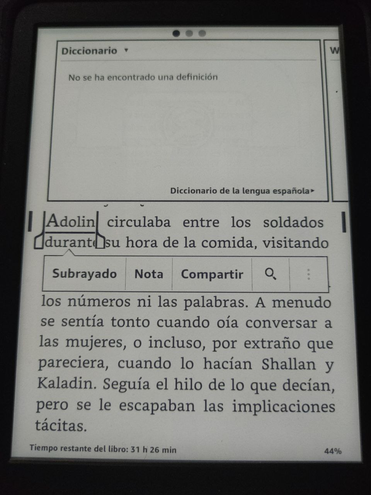
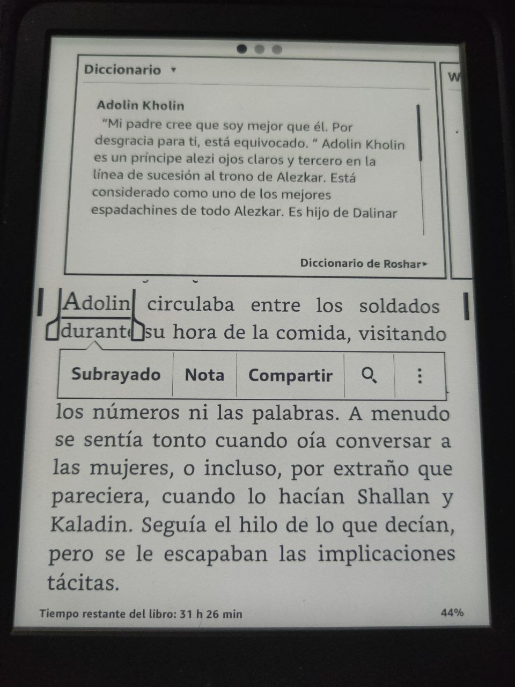

# Diccionario de Personajes del Cosmere

     

Este proyecto nace para resolver un problema común al leer libros en un eBook: no recordar quién es un personaje mientras estás inmerso en la lectura. A menudo, buscar información sobre un personaje en el móvil resulta tedioso o interrumpe la experiencia de lectura, lo que lleva a ignorarlo y seguir leyendo sin recordar quién era.

Este proceso te permite crear un diccionario personalizado y funcional para tu eBook de manera sencilla.
Este script permite generar, mediante los archivos de salida, un diccionario de personajes del **Cosmere**. Clasificados por cada libro y su respectivo planeta. Con esta herramienta, simplemente pulsas sobre un nombre y obtienes una breve descripción del personaje, similar a cómo las definiciones de otras palabras se muestran en un eBook. Esto permite recordar quién es el personaje sin interrumpir significativamente tu lectura.

**Nota**: Dentro de la carpeta **MOBI** están disponibles todos los diccionarios.

## Funcionamiento del Script

1. **Ejecución del Script**:  
   Al ejecutar el script, aparece un menú interactivo que te permite seleccionar los libros del Cosmere para los cuales deseas generar un diccionario.

2. **Extracción de Personajes**:  
   El script itera sobre los libros seleccionados, identifica los personajes que aparecen en cada uno y descarga una breve descripción de ellos.

3. **Generación de Archivos**:  
   Una vez que se han descargado todos los datos, el script crea una carpeta con los archivos necesarios (HTML, CSS, OPF y portada). Estos archivos son compatibles con **Kindle Previewer**, que se utiliza para generar el diccionario final en formato `.mobi`.

## Uso del Script

1. **Selección de Libros**:

   - Ejecución: _python cosmere_dictionary.py_
   - Al ejecutar el script, aparece en el terminal un menú interactivo que muestra una lista de libros del Cosmere.
   - Usa las teclas de flecha para desplazarte por la lista.
   - Presiona la barra espaciadora para seleccionar uno o varios libros (Se puede seleccionar la última opción y una vez pulsado enter, te permitirá incluir el nombre de un planeta. Ej: Yolen).
   - Pulsa Enter para confirmar tu selección y comenzar el proceso.

2. **Descarga de Personajes**:

   - El script abre una primera ventana del navegador que accede a la **máquina del tiempo** de la Coppermind, permitiéndote seleccionar una fecha específica para evitar incluir personajes de libros futuros y prevenir spoilers.
   - Una vez pasados 10 segundos, empieza a recolectar la información de los personajes automáticamente (Con un margen de 5 segundos entre peticiones para no saturar a llamadas la página).

3. **Extracción de Datos**:

   - Las descripciones cortas de los personajes se leen y almacenan automáticamente.

4. **Generación de Archivos**:

   - Una vez completada la extracción, el script genera como salida una carpeta que contiene:
     - **Archivo HTML**: Para el contenido del diccionario.
     - **Archivo CSS**: Diseña y organiza visualmente el diccionario.
     - **Archivo OPF**: Formato utilizado para generar un eBook.
     - **Cover del Libro**: Una portada correspondiente al libro seleccionado.

5. **Creación del Diccionario**:

   - Una vez que el script finaliza y crea la carpeta con los archivos de salida, el proceso para generar el diccionario final e integrarlo con tu eBook es sencillo. Pasos:

     #### 1. Instalar Kindle Previewer

     Enlace: [Descargar Kindle Previewer](hhttps://kdp.amazon.com/es_ES/help/topic/G202131170).

     #### 2. Generar el Archivo .mobi

     1. Abre **Kindle Previewer**.
     2. Dentro del programa, selecciona la opción **Abrir Archivo**.
     3. Navega hasta la carpeta generada por el script y selecciona el archivo `.opf` (por ejemplo, `Roshar_dictionary.opf`).
     4. Exportar como un archivo `.mobi`.

     #### 3. Integrar el Diccionario en tu eBook

     1. Conecta tu dispositivo eBook al ordenador.
     2. Navega a la carpeta llamada **dictionaries** en el almacenamiento de tu eBook.

     - Si esta carpeta no existe, puedes crearla manualmente.

     3. Copia el archivo `.mobi` generado por Kindle Previewer en esta carpeta.
     4. Desconecta el dispositivo de manera segura.

     #### 4. Reconocimiento Automático del Diccionario

     - Una vez incluido el archivo en la carpeta **dictionaries**, el eBook lo reconocerá automáticamente como un diccionario disponible.
     - Cuando selecciones el nombre de un personaje en tu lectura, el diccionario mostrará la descripción breve correspondiente, ayudándote a recordar quién es.

---

Ejemplo:

<div style="display: flex; justify-content: space-between;">
  
  
</div>

## Motivos por los que se ha usado Selenium

1. Permitir utilizar la _Máquina del Tiempo_ de la Coppermind y poder descargar los personajes de una fecha determinada, lo que evita posibles spoilers.
2. Las llamadas directas a la API de la Coppermind parecen estar bloqueadas, lo que impide el acceso a los datos a través de este método.

## Instalación y ejecución

1. Clona el repositorio:

   ```bash
   git clone https://github.com/AlejandroSalme/Cosmere_Characters_Dictionary
   ```

2. Navega al directorio del proyecto:

   ```bash
   cd Cosmere_Characters_Dictionary
   ```

3. Instala las dependencias:

   ```bash
   poetry install
   ```

4. Ejecutar script:
   ```bash
   python cosmere_dictionary.py
   ```

---
